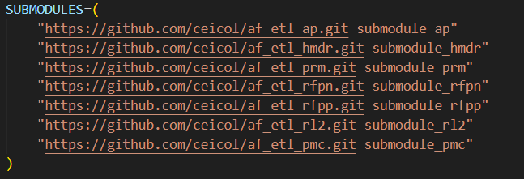

# Orquestador\_OTLS

**Orquestador\_OTLS** es una herramienta de automatización basada en Apache Airflow para ejecutar procesos ETL que migran datos a modelos extendidos definidos por el Ministerio de Ambiente y Desarrollo Sostenible (MADS) de Colombia.

---

## 📁 Estructura del proyecto

El directorio principal de trabajo es `airflow/`, y su estructura es la siguiente:

```
airflow/
├── config/              # Configuración de Airflow (e.g., airflow.cfg)
├── logic/               # Lógica central del orquestador (ETL y validaciones)
├── otl/                 # Scripts y librerías externas (e.g., ili2pg)
├── submodules/          # Submódulos Git para cada línea temática (AP, PRM, etc.)
├── tests/               # Pruebas unitarias organizadas por módulo
├── utils/               # Funciones auxiliares: Interlis, PostgreSQL, GX, etc.
├── .env                 # Variables de entorno (no versionar)
├── Dockerfile           # Imagen Docker personalizada
├── docker-compose.yaml  # Orquestación de servicios con Docker
├── requirements.txt     # Dependencias de Python
└── update_submodules.sh # Script para inicializar y actualizar submódulos
```

---

## 🧰 Requisitos previos

Antes de empezar, asegúrate de tener instalado lo siguiente:

* Python 3.8 o superior
* Git
* Docker
* Docker Compose
* Nano (opcional, para edición rápida en terminal)

### Instalación en Debian/Ubuntu

```bash
sudo apt update
sudo apt install python3 python3-pip git docker.io docker-compose nano
```

Verifica que Docker esté activo:

```bash
sudo systemctl start docker
sudo systemctl enable docker
```

---

## 📥 Clonar el repositorio

```bash
git clone https://github.com/ceicol/Orquestador_OTLS.git
cd Orquestador_OTLS/airflow/
```

Otorga permisos (opcional si ya tienes acceso total):

```bash
sudo chmod -R 777 Orquestador_OTLS/
```

---

## 🔗 Configuración de submódulos

Este proyecto utiliza submódulos Git para incluir diferentes proyectos ETL.

### Paso 1: Revisar el script

Abre el archivo `update_submodules.sh`:

```bash
nano update_submodules.sh
```

Ejemplo de submódulo definido:

```bash
"https://github.com/ceicol/af_etl_prm.git submodule_prm"
```

> Vista del script configurado:
> 

### Paso 2: Ejecutar el script

```bash
./update_submodules.sh
```

Este script:

* Elimina submódulos anteriores
* Agrega los nuevos submódulos definidos
* Inicializa y actualiza su contenido
* Ejecuta `configure.sh` si existe en el submódulo

---

## 🐳 Levantar entorno con Docker

Inicia los servicios con:

```bash
docker compose up -d
```

Esto levantará los servicios de Airflow definidos en `docker-compose.yaml`.

---

## 🧪 Pruebas

### Opción A: Ejecutar pruebas localmente (sin Docker)

1. Crear entorno virtual:

```bash
python3 -m venv .venv
source .venv/bin/activate
```

2. Instalar dependencias:

```bash
pip install -r requirements.txt
```

3. Ejecutar pruebas:

```bash
python3 -m unittest -b tests.test_utils
# o todas
coverage run -m unittest discover -s tests -t .
```

4. Reporte de cobertura:

```bash
coverage report -m
coverage xml
coverage html
```

---

### Opción B: Ejecutar pruebas con Docker

1. Levantar servicios:

```bash
docker compose up -d
```

2. Ejecutar pruebas:

```bash
docker compose run --rm test-runner
```