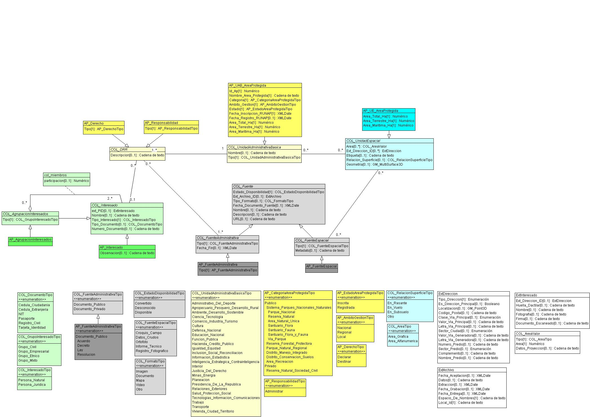

# Repositorio del modelo extendido LADM_COL de Áreas Protegidas del SINAP

La conformación de Sistemas de Áreas Protegidas obedece a un enfoque ecosistémico, estrategia que desde el desde el Convenio de Diversidad Biológica y la Unesco, se propone para alcanzar un manejo equitativo de la tierra, el agua y los recursos vivos, a favor de su conservación, usos sostenibles y distribución equitativa de los beneficios que puedan generar.

La Ley 165 de 1994 define área protegida en su artículo 2 como un área definida geográficamente, que haya sido designada, regulada y administrada a fin de alcanzar objetivos específicos de conservación. 

Posteriormente, la Unión Internacional para la Conservación de la Naturaleza – UICN, define el concepto como “Un espacio geográfico claramente definido, reconocido, dedicado y gestionado, mediante medios legales u otros tipos de medios eficaces para conseguir la conservación a largo plazo de la naturaleza y de sus servicios ecosistémicos y sus valores culturales asociados”, (Dudley, 2008). 

El Sistema Nacional de Áreas Protegidas – SINAP es el conjunto de las áreas protegidas privadas, comunitarias y públicas, del ámbito de gestión local, regional y nacional, los actores sociales e institucionales, los arreglos de gobernanza e instrumentos de gestión que, articulados entre sí, son necesarios para su conservación, (Ministerio de Ambiente y Desarrollo Sostenible & Parques Nacionales Naturales de Colombia, 2020). 

