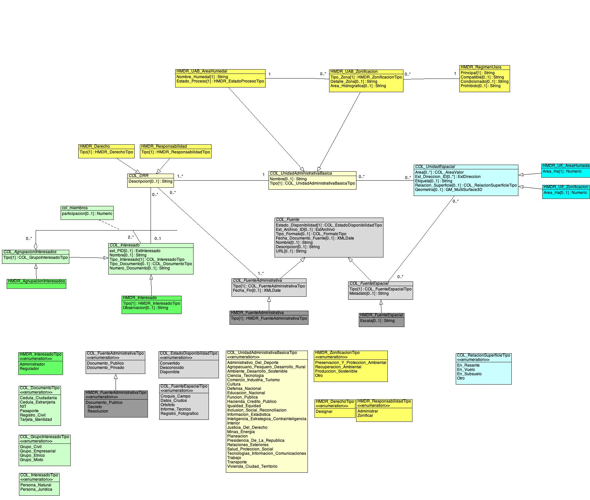

# Repositorio del modelo extendido LADM_COL de humedales de importancia internacional RAMSAR

Según el Convenio Ramsar protección de humedales, en su artículo número 1 del protocolo define una zona húmeda o humedal como cualquier extensión de marisma, pantano o turbera, o superficie cubierta de aguas, sean estas de régimen natural o artificial, permanentes o temporales, estancadas o corrientes, dulces, salobres o saladas, incluidas las extensiones de aguas marinas cuya profundidad en marea baja no exceda de seis metros, (UNESCO, 1971). De este modo, los humedales se clasifican en humedales marinos y costeros, humedales continentales y humedales artificiales. En Colombia, la extensión de humedales es de 2.589.839 Hectáreas, representadas en áreas de cobertura de cuerpos de agua naturales continentales, hidrófitas continentales, lagunas costeras y manglares.

Colombia tiene actualmente 12 sitios designados como Humedales de Importancia Internacional (sitios Ramsar): 

- Delta del Río Baudó y Delta del Río San Juan
- Sistema Lacustre de Chingaza
- Sistema Delta Estuarino del Río Magdalena, Ciénaga Grande de Santa Marta
- Laguna de La Cocha
- Estrella Fluvial del Inirida
- Complejo de Humedales Lagos de Tarapoto
- Laguna del Otún
- Complejo de Humedales Alto Río Cauca asociado a la Laguna de Sonso
- Complejo Cenagoso de Ayapel
- Complejo Cenagoso de Zapatosa
- Complejo de Humedales de la Cuenca del Río Bita
- Complejo de Humedales Urbanos del Distrito Capital de Bogotá

